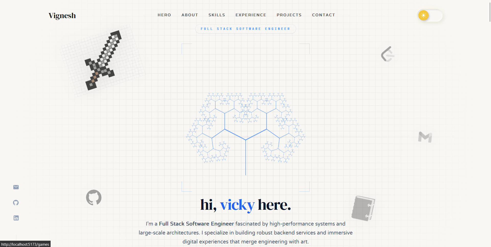
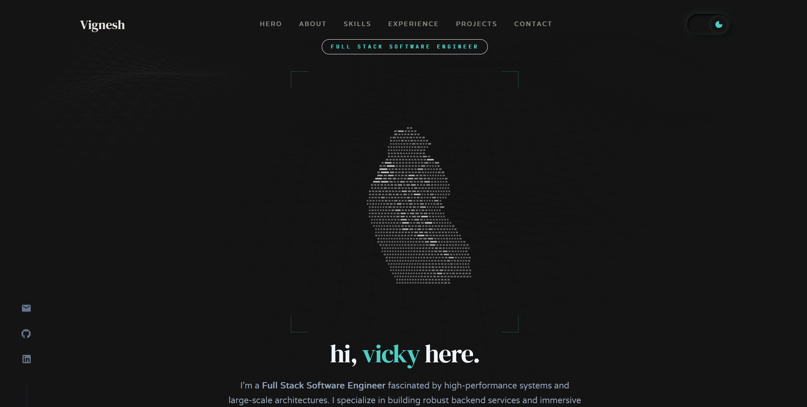

# lightning-portfolio

lowkey built this. it exists (no cap). built with React, TS, and some Three.js because plain HTML is literally mid.

there's spinning things and glowing cards. if you're into that aura, cool i guess.

## Screenshots (lowkey fire)

| Light Theme (flashbang) | Dark Theme (smooth vibes) |
|---|---|
|  |  |

## The "Stack" (bet)

- **React / Vite**: because waiting for builds is an absolute L.
- **Three.js**: used math to make things rotate. don't even ask, my brain is cooked.
- **Framer Motion**: for those jit animations.
- **Tailwind**: because writing CSS from scratch is not it.

## Features (aura +1000)

- **The Sphere**: a globe of skills. you can drag it or whatever.
- **Sticky Spots**: featured projects that stay in your face longer than they should.
- **Contact CLI**: a fake terminal. looks hacker-ish for the gram.
- **Logo**: i'm goated for this one. click my name, it turns colors. 

## Run it (if you're not busy being a NPC)

1. git clone this fr.
2. `npm install` (rip to your node_modules).
3. `npm run dev`
4. go to `localhost:5173`.
5. leave a star or don't. it's fine.

delulu is the solulu.
